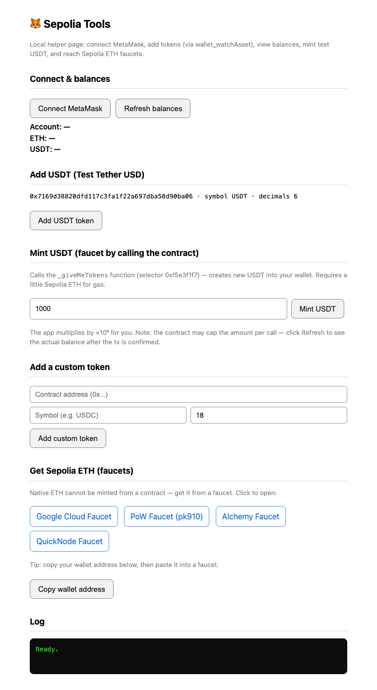

# 🦊 Sepolia Tools

**English** · [Tiếng Việt ↓](#-tiếng-việt)

A **local** helper page for working with a MetaMask wallet on the **Sepolia testnet**:

- Connect MetaMask, view **ETH** and **USDT** balances in real time
- **Add tokens** to MetaMask via `wallet_watchAsset` (works around MetaMask's manual-import bug where a token shows "added" but never appears)
- **Mint test USDT** directly by calling the token contract
- Quick links to **faucets** for Sepolia ETH

Everything runs offline on your machine (a single static HTML file + a simple HTTP server). No backend, no data collection.



---

## 🚀 Quick start

```bash
./start.sh
```

The script will:
1. Serve the app at `http://localhost:8765/`
2. Open your default browser automatically

Use a different port: `./start.sh 9000`

Stop the app: press `Ctrl+C`.

> Requirements: `python3` (preinstalled on macOS/Linux) and a browser with **MetaMask** installed.

## 📖 Usage

1. **Connect & balances** — Click **Connect MetaMask** → pick an account → the app switches to Sepolia if needed. ETH and USDT balances show immediately. Click **Refresh balances** to update.
2. **Add USDT** — Click **Add USDT token** → approve the "Add suggested token" popup. Use this when MetaMask's manual import says "added" but the token never appears.
3. **Mint USDT** — Enter an amount (the app multiplies by ×10⁶ for you) → **Mint USDT** → **Confirm** in MetaMask. Needs a little Sepolia ETH for gas. Wait ~15s, then **Refresh balances**.
4. **Add a custom token** — Enter contract address, symbol, decimals → **Add custom token**.
5. **Get Sepolia ETH** — Click **Copy wallet address**, then open a faucet and paste it.

## 🪙 USDT token (Test Tether USD)

| Property | Value |
|---|---|
| Network | Sepolia (chainId `11155111` / `0xaa36a7`) |
| Contract | `0x7169d38820dfd117c3fa1f22a697dba58d90ba06` |
| Symbol | USDT |
| Decimals | **6** |
| Mint function | `_giveMeTokens(uint256)` — selector `0xf5e3f1f7` (public faucet) |

> The mint selector was verified directly from the input data of a successful on-chain mint transaction — not guessed.

## ❓ Mint vs Faucet

| | **Mint** | **Faucet** |
|---|---|---|
| Nature | **Creates new** tokens from a contract (increases total supply) | **Hands out** existing coins from a pre-funded pool |
| Used for | ERC-20 tokens that expose a mint function | Native coin (Sepolia ETH) |
| How | You call the contract function from your wallet | A website/service sends it to you |

**Native ETH cannot be minted** because no contract controls its supply — you can only get it from a faucet. ERC-20 tokens define their own mint function, so anyone allowed to call it can create new tokens.

## 📁 Structure

```
sepolia-tools/
├── index.html        # the whole app (UI + logic)
├── start.sh          # start the server + open the browser
├── README.md         # this file (English + Vietnamese)
├── docs/
│   └── screenshot.png
└── .gitignore
```

## 🔒 Security

- The app **never** asks for your seed phrase / private key. Every transaction is signed through the MetaMask popup.
- For **Sepolia testnet only**. Do not use with real assets on mainnet.
- The faucet funds and tokens here are for testing only and have **no real monetary value**.

<br/>

---
---

<br/>

# 🦊 Tiếng Việt

[↑ English](#-sepolia-tools) · **Tiếng Việt**

Trang trợ giúp **local** để làm việc với ví MetaMask trên mạng **Sepolia testnet**:

- Kết nối MetaMask, xem số dư **ETH** và **USDT** real-time
- **Thêm token** vào MetaMask qua `wallet_watchAsset` (khắc phục lỗi import thủ công bị treo của MetaMask)
- **Mint USDT** trực tiếp bằng cách gọi hàm contract
- Link nhanh tới các **faucet** lấy Sepolia ETH

Toàn bộ chạy offline ở máy bạn (một file HTML tĩnh + server HTTP đơn giản). Không có backend, không thu thập dữ liệu.

## 🚀 Chạy ngay

```bash
./start.sh
```

Script sẽ phục vụ app tại `http://localhost:8765/` và tự mở trình duyệt. Đổi port: `./start.sh 9000`. Dừng: `Ctrl+C`.

> Yêu cầu: `python3` (có sẵn trên macOS/Linux) và trình duyệt đã cài **MetaMask**.

## 📖 Hướng dẫn sử dụng

1. **Kết nối & số dư** — Bấm **Connect MetaMask** → chọn account → app tự chuyển sang Sepolia nếu cần. Số dư ETH/USDT hiển thị ngay. Bấm **Refresh balances** để cập nhật.
2. **Thêm USDT** — Bấm **Add USDT token** → approve popup "Add suggested token". Dùng khi import thủ công báo "added" nhưng token không hiện.
3. **Mint USDT** — Nhập số lượng (app tự nhân ×10⁶) → **Mint USDT** → **Confirm** trong MetaMask. Cần ít Sepolia ETH trả gas. Đợi ~15s rồi **Refresh balances**.
4. **Thêm token tùy ý** — Nhập contract address, symbol, decimals → **Add custom token**.
5. **Lấy Sepolia ETH** — Bấm **Copy wallet address**, mở faucet và dán địa chỉ vào.

## 🪙 Token USDT (Test Tether USD)

| Thuộc tính | Giá trị |
|---|---|
| Network | Sepolia (chainId `11155111` / `0xaa36a7`) |
| Contract | `0x7169d38820dfd117c3fa1f22a697dba58d90ba06` |
| Symbol | USDT |
| Decimals | **6** |
| Hàm mint | `_giveMeTokens(uint256)` — selector `0xf5e3f1f7` (public faucet) |

> Selector mint được xác thực trực tiếp từ input của một giao dịch mint thành công on-chain, không phải đoán.

## ❓ Mint khác Faucet thế nào?

| | **Mint** | **Faucet** |
|---|---|---|
| Bản chất | Tạo **mới** token từ contract (tăng total supply) | Phát **lại** coin có sẵn từ kho nạp trước |
| Dùng cho | Token ERC-20 có hàm mint | Coin gốc/native (Sepolia ETH) |
| Cách làm | Gọi thẳng hàm contract qua ví | Website/dịch vụ gửi cho bạn |

**ETH gốc không mint được** vì không contract nào quản lý nguồn cung — chỉ lấy qua faucet. Token ERC-20 thì contract tự định nghĩa hàm mint nên gọi được là tạo token mới.

## 🔒 Bảo mật

- App **không bao giờ** hỏi seed phrase / private key. Mọi giao dịch ký qua popup MetaMask.
- Chỉ dùng cho **testnet Sepolia**. Không dùng với tài sản thật trên mainnet.
- Faucet và token ở đây chỉ có giá trị thử nghiệm, **không có giá trị tiền thật**.
